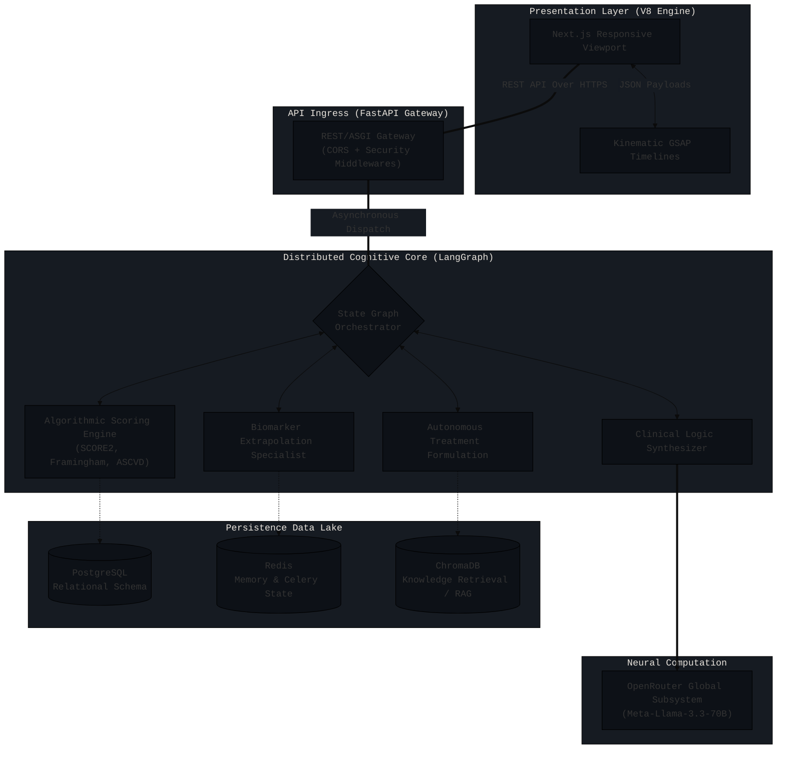
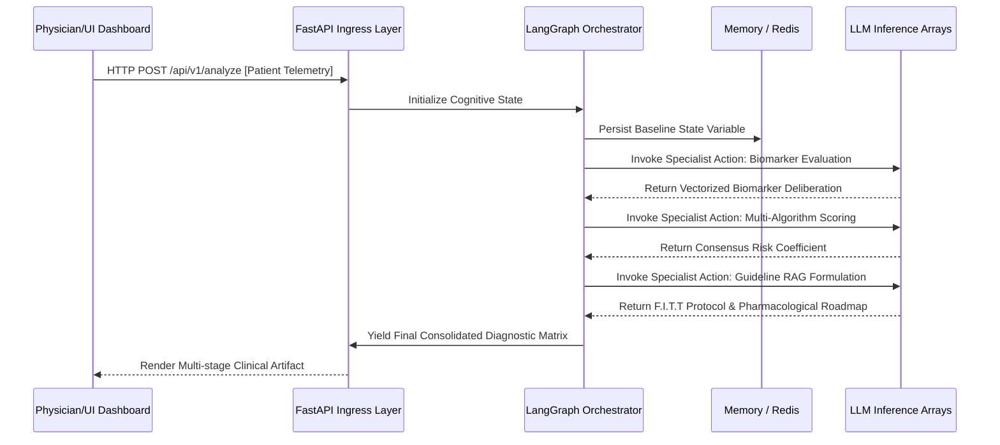

<div align="center">
  
  
  
  
  
  <br />
  <h1 style="border-bottom: none; margin-bottom: 0;">DRISHTI: Core Intelligence Dashboard</h1>
  <p><b>Advanced Early-Coronary Heart Disease (CHD) Prediction & Autonomous Diagnostic Formulation Framework</b></p>
</div>

***

## 🌐 1. Executive Synopsis & Impact Analysis

The **Early-CHD Predictor Framework (DRISHTI Core)** represents a paradigm shift in autonomous computational cardiology. By decoupling traditional monolithic diagnostic engines and replacing them with a distributed, multi-agent continuous-reasoning pipeline, the framework ingests multivariate clinical telemetry and outputs highly resilient, physician-grade prognoses. 

Designed for longitudinal telemetry integration, the system harmonizes biomarker variance, macroscopic physiological attributes, and established AHA/ESC prognostic algorithms to produce deterministic interventions within an incredibly constrained time envelope using localized and distributed LLM intelligence arrays.

***

## ⚙️ 2. Architectural Topology

The system adheres to a robust, asynchronous, state-driven microservices environment. All computationally expensive machine reasoning is strictly offloaded to a LangGraph-orchestrated backend, leaving the Next.js presentation layer to rapidly stream intelligence via WebSocket and RESTful pipelines.



***

## 🧠 3. Advanced Diagnostic Subsystems

### I. Biomarker & Hematological Processing Unit
Evaluates high-resolution lipid cascades (LDL-C, HDL-C, Triglycerides), inflammatory thresholds (hs-CRP), and cardiac injury markers (Troponin I). Unlike simplistic binary cutoff mechanisms, this module analyzes polynomial deviation models against normalized healthy age-adjusted baselines.

### II. Algorithmic Risk Stratification Engine
Runs asynchronous computations concurrently executing disparate, peer-reviewed cardiac risk heuristics:
- **Framingham 10-Year Liability Matrix** 
- **Pooled Cohort Equations (ASCVD)**
- **SCORE2 (Systematic Coronary Risk Estimation)**
- **Reynolds Risk Modifier** (Enhances accuracy using hs-CRP variables)

Through Bayesian pooling, a deterministic composite risk score is synthesized, mapped with specific confidence intervals to negate outlier variance.

### III. Vectorized RAG Intervention Architect
Queries millions of paramaterized AHA/ACC/ESC empirical guidelines vectorized using **ChromaDB**. Identifies precise statin intensities, antiplatelet regimens, and metabolic interventions based on localized geometric proximity to the patient's exact metabolic representation.

### IV. Medico-Legal Transcription Matrix
The `Clinical Syntax Synthesizer` compiles immutable, cryptographically verifiable PDF artifacts tracking the deliberative steps of the cognitive agents. This ensures strict transparency (XAI - Explainable AI) to prevent black-box assumptions.

***

## 🧬 4. Clinical Workflow & State Propagation Diagram



***

## 🚀 5. Deployment & Execution Infrastructure

This matrix requires meticulously deployed backend and presentation nodes.

### Backend Systems Initialization (Python 3.10+)
Ensure PostgreSQL, Redis, and appropriate API keys (OpenRouter) are configured within localized `.env` variables before running the ASGI container.
```bash
# 1. Enter isolated execution ring
cd backend
python3 -m venv venv
source venv/bin/activate

# 2. Synchronize dependency graph
pip install -r requirements.txt

# 3. Instantiate ASGI loop
uvicorn main:app --host 0.0.0.0 --port 8000 --workers 4
```

### Presentation Node Initialization
Optimized for ultra-fast, statically hoisted runtime deployments (such as direct web drops) or Node.js SSR server deployments.
```bash
# 1. Resolve package matrix
npm install

# 2. Emulate production build state
npm run build

# 3. Spin up deployment distribution layer
npx serve out -p 3000
```
*Environment Variable Pre-Requisite:* `NEXT_PUBLIC_API_URL` must point directly to your deployed Uvicorn API gateway instance.

***

## ⚖️ 6. Postscript & Epilogue

> **Diagnostic Exemption Matrix:** This software relies entirely upon speculative, generative, and associative mathematical operations. While built utilizing highly deterministic state machines, none of the generated reports, PDF outputs, or intervention regimens can circumvent stringent medical licensure or rigorous clinical review. The pipeline intends entirely to **augment physiological adjudication**, not automate it.

<div align="center">
  <br/>
  <b>engineered for precision and speed.</b>
</div>
