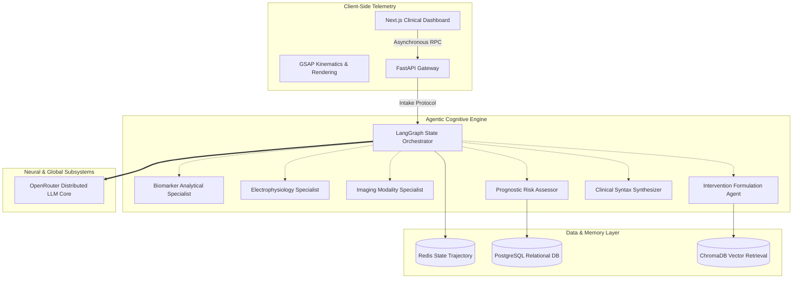

# Agentic Early-Coronary Heart Disease (CHD) Prediction Framework

A clinically integrated, multi-agent diagnostic and intervention pipeline utilizing LangGraph orchestrated AI specialists. This system synthesizes multifaceted patient data—ranging from lipid expression panels to complex risk factors—yielding statistically vigorous cardiovascular risk evaluations intrinsically synchronized with the latest prognostic algorithms (AHA/ACC, ESC).

## System Architecture Topology

The infrastructure embraces a highly decoupled microservices-based paradigm, utilizing asynchronous workload ingestion via FastAPI and high-fidelity clinical telemetry rendering via Next.js. The computation pathways eschew monolithic processing in favor of a graph-based cognitive orchestrator.



## Core Cognitive Subsystems

### 1. Biomarker Trajectory Analysis
Iteratively evaluates lipid profiles (LDL-C, HDL-C), metabolic substrates (Fasting Glucose, HbA1c), and inflammatory cascade markers (hs-CRP). The engine generates quantitative differentials transcending simplistic reference-range binaries, calculating continuous-risk variances against age-adjusted normative vectors.

### 2. Algorithmic Risk Stratification
Derives a composite heuristic threat score via simultaneous evaluation across disparate risk assessment matrixes. The consensus protocol evaluates:
- **Framingham 10-Year CVD Liability** 
- **Pooled Cohort Equations (ASCVD)**
- **SCORE2 (Systematic Coronary Risk Estimation)**
- **Reynolds Risk Matrix** (amplified by hs-CRP gradients)

### 3. Evidenced-Based Intervention Architect
Parses upstream diagnostics to formulate deterministic pharmacological modifications. Queries vectorized clinical literature databases (RAG) to fetch empirical AHA/ACC guidelines, validating dosage methodologies for high-intensity statin protocols or secondary preventative measures.

### 4. Cryptographic Reporting
Instantiates immutable PDF artifacts derived directly from the cognitive deliberation chain. Ensures zero data ablation during transcription from mathematical risk models to human-readable clinical narratives.

## Execution Requirements & Initialization

The repository utilizes distinct modular boundaries, requiring synchronized daemon execution for local development arrays.

### Backend Daemon (FastAPI)
Requires Python 3.10+ and environment-specific variable binding (LLM gateways, Database URIs).
```bash
cd backend
python -m venv venv
source venv/bin/activate
pip install -r requirements.txt
uvicorn main:app --host 0.0.0.0 --port 8000 --reload
```

### Frontend Server
Configured for static compilation or persistent Node.js serving.
```bash
npm install
npm run build
npm run start
```

## Epilogue: Medico-Legal Preconditions
This matrix represents advanced investigational machine learning methodology. The predictive schemas enclosed within are explicitly designed to augment, not supersede, licensed physiological adjudication. Under no operational parameter should these outputs bypass rigorous empirical validation by clinical professionals.
